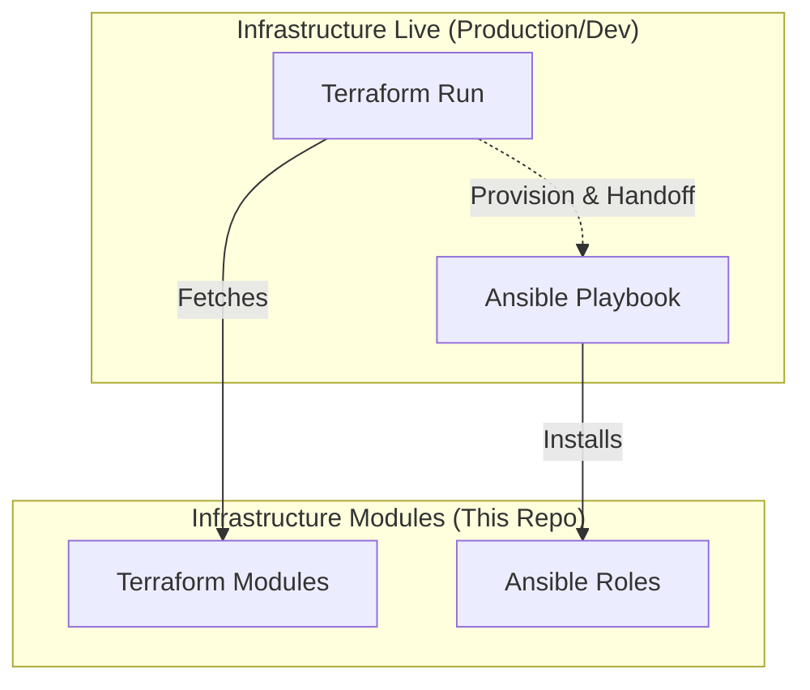

# 🏗️ Homelabs Infrastructure Modules

A centralized repository for reusable, version-controlled **Terraform Modules** and **Ansible Roles**. This repository serves as the "source of truth" for infrastructure building blocks across all environments.

## 📂 Repository Structure

```text
homelabs-infrastructure-module/
├── terraform/                   # Reusable Terraform Modules
│   ├── talos-instance/          # Provision a Talos KVM node
│   ├── vm-instance/             # Provision a generic Ubuntu KVM node
│   └── database/                # e.g., PostgreSQL VM/Instance
└── ansible/                     # Reusable Ansible Content
    ├── roles/                   # Standardized Roles
    │   ├── common/              # Base security, users, ssh config
    │   ├── patching/            # OS updates logic
    │   ├── elasticsearch/       # Installation & clustering logic
    │   └── kafka/               # Kafka setup logic
    └── requirements.yml         # Shared external dependencies
```

---

## 🚀 How to use in "Live" Infrastructure

The "Client" repository (e.g., `infrastructure-live`) calls these modules using Git-based references.

### A. Calling Terraform Modules
In your client repository (e.g., `infrastructure-live/terraform/dev/main.tf`), point directly to the subdirectory of this Git repository.

```hcl
module "my_vm" {
  # Syntax: git::URL//path/to/module?ref=version
  source = "git::github.com/venndev20999/homelabs-infrastructure-module.git//terraform/vm-instance?ref=v1.0.0"
  
  name       = "web-server"
  ip_address = "192.168.122.50"
  # ... other variables
}
```

> [!TIP]
> Using `?ref=v1.0.0` is critical. It allows you to update the module repo without immediately breaking all your environments.

### B. Calling Ansible Roles
In your client repository (e.g., `infrastructure-live/ansible/requirements.yml`), define the Git source for the roles.

```yaml
# infrastructure-live/ansible/requirements.yml
roles:
  - name: internal.patching
    src: https://github.com/venndev20999/homelabs-infrastructure-module.git
    scm: git
    version: v1.0.0
    # This 'path' tells Ansible where inside the repo the roles are
    path: ansible/roles/patching
```

To download these to your local machine:
```bash
ansible-galaxy install -r requirements.yml -p ./roles/
```

---

## 🛠️ The "Hybrid" Pattern (Best Practice)
Sometimes, you want Terraform to automatically trigger the Ansible run after provisioning. You can achieve this using a `local-exec` provisioner.

**Example: `terraform/vm-instance/main.tf`**
```hcl
resource "null_resource" "ansible_run" {
  # Trigger this whenever the VM is created or the IP changes
  triggers = {
    instance_id = libvirt_domain.vm.id
    ip          = var.ip_address
  }
  
  provisioner "local-exec" {
    # This calls a local playbook using the newly provisioned IP
    command = "ansible-playbook -i '${var.ip_address},' -u user site.yml"
  }
  
  depends_on = [libvirt_domain.vm]
}
```

---

## 📊 Integration Flow



---

## 📝 Usage Summary

| Tool | Mechanism | Method |
| :--- | :--- | :--- |
| **Terraform** | source block | Git URL + sub-path (//terraform/vm) |
| **Ansible** | requirements.yml | ansible-galaxy install |
